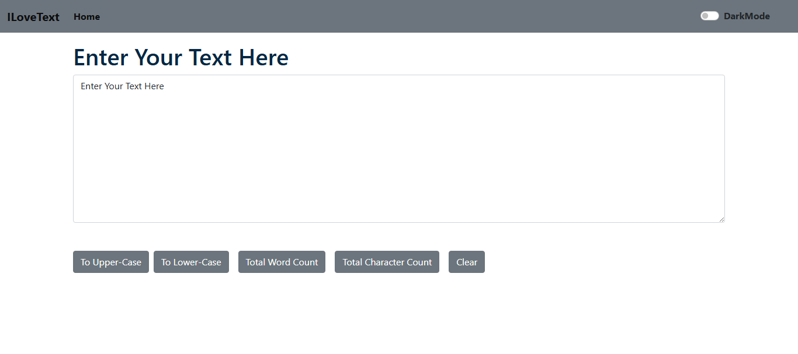

# ✨ iLoveText


A modern **React-based Text Utility App** that allows users to quickly manipulate and analyze text with a clean and responsive UI.

---

## 🌐 Live Demo

🔗 https://your-live-link.com  

---

## 📸 Preview



---

## 🚀 Features

- 🔠 Convert text to **UPPERCASE**
- 🔡 Convert text to **lowercase**
- 📊 Real-time **Word Count**
- 🔢 Real-time **Character Count**
- 🧹 Clear text instantly
- 🌙 **Dark Mode / Light Mode** toggle
- ⚡ Smooth and responsive UI

---

## 🛠️ Tech Stack

- ⚛️ React.js (Create React App)
- 💡 JavaScript (ES6)
- 🎨 CSS / Bootstrap

---

## 📂 Project Structure


```bash
iLoveText/
│
├── public/
├── src/
│ ├── components/
│ ├── App.js
│ ├── index.js
│
├── package.json
└── README.md
```


---

## ⚙️ Installation & Setup

### 1. Clone the repository

```bash
git clone https://github.com/kahkasha17/iLoveText.git 
```


### 2. Navigate to the project
```bash
cd iLoveText 
```

### 3. Install dependencies
```bash 
npm i
 ```

### 4. Run the app
```bash
npm start
 ```


👉 Runs on:
```bash 
http://localhost:3000
```

---

## 💡 Usage

- Enter text in the input box  
- Use buttons to transform text  
- View word & character count instantly  
- Toggle dark mode for better experience  

---

## 🔮 Future Enhancements

- 📋 Copy to Clipboard
- 📄 Download as TXT/PDF
- 🔊 Text-to-Speech
- 🌍 Multi-language Support
- 📱 PWA Support

---

## 🤝 Contributing

Pull requests are welcome!  
For major changes, please open an issue first.

---

## 👩‍💻 Author

**Kahkasha Khan**  
💼 Frontend Developer | MERN Stack  

📧 **Email:** [kahkashakhan1417@gmail.com](mailto:kahkashakhan1417@gmail.com)  
💼 **LinkedIn:** [https://www.linkedin.com/in/kahkasha-rafat-fatima-8672a0231/](https://www.linkedin.com/in/kahkasha-rafat-fatima-8672a0231/)  
🐙 **GitHub:** [https://github.com/kahkasha17/](https://github.com/kahkasha17/)  

---

## ⭐ Support

If you like this project, give it a ⭐ on GitHub!
